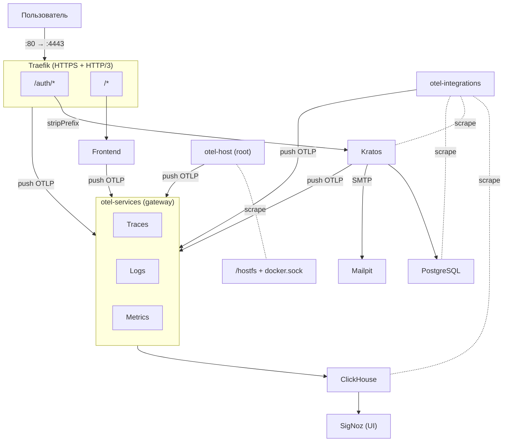

# FullStack Template

Production-ready шаблон полнофункционального веб-приложения с встроенной аутентификацией и наблюдаемостью (observability). Одна команда — полностью рабочее окружение.

```
docker compose up --build
```

| Сервис     | URL                          |
| ---------- | ---------------------------- |
| Приложение | https://localhost:4443       |
| SigNoz     | http://localhost:8080        |
| Mailpit    | http://localhost:8025        |

## Стек

| Слой               | Технология                                                       |
| ------------------- | ---------------------------------------------------------------- |
| Frontend            | React 19 · TanStack Start · Nitro · Vite                        |
| Аутентификация      | Ory Kratos                                                       |
| База данных         | PostgreSQL                                                       |
| Reverse Proxy       | Traefik (HTTPS + HTTP/3)                                         |
| Observability       | OpenTelemetry · SigNoz · ClickHouse                              |
| Email (dev)         | Mailpit                                                          |

## Архитектура



Все сервисы размещены за **единым origin** (`localhost:4443`), что устраняет cross-origin сложности с cookies.

## Принципы

### Zero-touch startup

`docker compose up --build` — единственная команда. Миграции, регистрация пользователей, импорт дашбордов — всё происходит автоматически через init-сервисы.

### Атомарные env-переменные

Env-файлы в `.env/` хранят только атомарные значения (host, port, user, password). Составные значения (DSN, URL) собираются в entrypoint-скриптах каждого сервиса. Это исключает дублирование и рассинхронизацию.

### Модульность

Каждый компонент — самодостаточная директория со своим `compose.yaml`, `Dockerfile` и конфигурацией. Корневой `docker-compose.yaml` лишь подключает модули через `include:`.

### Наблюдаемость из коробки

Телеметрия (логи, трейсы, метрики) настроена для всех компонентов — от приложения до инфраструктуры. После старта в SigNoz доступны 7 готовых дашбордов.

### Минимальные привилегии

Каждый сервис получает через `env_file` только те переменные, которые ему необходимы. OTel-коллекторы разделены по уровню привилегий.

### HTTPS в dev = HTTPS в prod

TLS включён даже в локальной разработке. Traefik генерирует самоподписанный сертификат для dev, при деплое подключается ACME.

## Структура

```
.
├── docker-compose.yaml             # include всех модулей
├── docker-compose.override.yaml    # env-файлы, depends_on, restart policy
│
├── .env/                           # атомарные env-переменные
│   ├── clickhouse.env
│   ├── frontend.env
│   ├── kratos.env
│   ├── otel-collector.env
│   ├── postgres.env
│   ├── signoz.env
│   ├── smtp.env
│   └── traefik.env
│
├── frontend/                       # React 19 + TanStack Start + Nitro
│   ├── Dockerfile                  # multi-stage: builder → production
│   ├── instrumentation.ts          # OpenTelemetry SDK (gRPC)
│   ├── nitro.config.ts             # OTel как Nitro plugin
│   ├── vite.config.ts
│   └── src/
│       ├── logger.ts               # Pino: pretty + OTel transport
│       ├── router.tsx
│       └── routes/
│           ├── __root.tsx           # HTML shell
│           ├── index.tsx            # главная страница
│           ├── health.ts            # server-only healthcheck
│           ├── login.tsx            # ┐
│           ├── registration.tsx     # │ Kratos self-service UI
│           ├── recovery.tsx         # │ (flow-based rendering)
│           ├── verification.tsx     # │
│           └── settings.tsx         # ┘
│
├── kratos/                         # Ory Kratos — аутентификация
│   ├── Dockerfile                  # COPY --from бинарника
│   ├── entrypoint.sh               # сборка DSN, URL из env
│   ├── kratos.yaml                 # password + code, OTel tracing
│   └── identity.schema.json        # email-based identity
│
├── traefik/                        # Reverse proxy + TLS + HTTP/3
│   ├── Dockerfile                  # envsubst для шаблонизации
│   ├── entrypoint.sh               # envsubst < template.yml > traefik.yml
│   ├── template.yml                # статическая конфигурация (шаблон)
│   └── dynamic/                    # динамическая конфигурация
│       ├── frontend.yml            # /* → frontend (priority 1)
│       └── ory-kratos.yaml         # /auth/* → kratos (priority 2)
│
├── otel-collectors/                # OpenTelemetry коллекторы
│   ├── Dockerfile                  # SigNoz OTel Collector + healthcheck
│   ├── entrypoint.sh               # сборка ClickHouse DSN
│   ├── compose.yaml                # otel-services, otel-host, otel-integrations, otel-migrator
│   ├── services.yaml               # gateway: OTLP → ClickHouse (traces, logs, metrics)
│   ├── host.yaml                   # edge: hostmetrics + docker_stats → gateway
│   └── integrations.yaml           # edge: prometheus scrape + postgresql → gateway
│
├── clickhouse/                     # ClickHouse — хранилище телеметрии
│   ├── Dockerfile                  # + SigNoz histogramQuantile UDF
│   ├── compose.yaml
│   ├── cluster.xml                 # ClickHouse Keeper (single-node)
│   ├── prometheus.xml              # Prometheus endpoint для мониторинга
│   └── histogramQuantile.xml       # UDF для расчёта перцентилей
│
├── postgres/                       # PostgreSQL — БД для Kratos
│   ├── Dockerfile                  # + кастомный healthcheck
│   ├── compose.yaml
│   ├── init.sh                     # CREATE DATABASE + GRANT pg_monitor
│   └── healthcheck.sh              # SELECT 1 (строже чем pg_isready)
│
└── signoz/                         # SigNoz — UI для observability
    ├── Dockerfile                  # + healthcheck + entrypoint
    ├── compose.yaml                # + signoz-bootstrap (python)
    ├── entrypoint.sh               # сборка ClickHouse DSN
    ├── bootstrap.py                # авто-регистрация, импорт дашбордов
    └── dashboards/                 # 7 готовых дашбордов
        ├── apm_metrics.json
        ├── clickhouse_overview.json
        ├── container_metrics.json
        ├── db_calls_monitoring.json
        ├── host_metrics.json
        ├── http_api_monitoring.json
        └── postgres_overview.json
```

## OTel-коллекторы

Три коллектора разделены по профилю привилегий и модели сбора:

| Коллектор          | Модель | Образ                           | Привилегии            | Назначение                                         |
| ------------------ | ------ | ------------------------------- | --------------------- | -------------------------------------------------- |
| `otel-services`    | push   | signoz/signoz-otel-collector    | user 1001             | Gateway: приём OTLP, запись в ClickHouse            |
| `otel-host`        | pull   | otel/opentelemetry-collector-contrib | root (0:0), /hostfs   | Edge: метрики хоста + Docker                        |
| `otel-integrations`| pull   | otel/opentelemetry-collector-contrib | обычный               | Edge: scrape ClickHouse, Kratos, PostgreSQL          |

Push-модель используется для контролируемого кода (frontend, Traefik) — приложения сами отправляют телеметрию через OTLP SDK. Подключение через pull (например, прокидывание лог-файлов) увеличивало бы связанность модулей шаблона.

Edge-коллекторы пересылают данные в `otel-services` через OTLP, образуя **fan-in** топологию.

## Конфигурация

### Env-файлы

Переменные сгруппированы по сервису-владельцу в `.env/`:

```
.env/
├── traefik.env         # DOMAIN, PORT
├── frontend.env        # FRONTEND_HOST, FRONTEND_PORT
├── kratos.env          # KRATOS_HOST, порты, KRATOS_DB
├── postgres.env        # POSTGRES_HOST, порт, логин, пароль
├── clickhouse.env      # CLICKHOUSE_HOST, порт, логин, пароль
├── otel-collector.env  # OTEL_COLLECTOR_HOST, порты (gRPC/HTTP)
├── signoz.env          # SIGNOZ_HOST, порт, root-пользователь
└── smtp.env            # SMTP_HOST, SMTP_PORT
```

Секреты для production размещаются в `*.secret.env` (добавлены в `.gitignore`).

### Entrypoint-паттерн

Каждый сервис, которому нужны составные значения (DSN, URL), собирает их из атомарных переменных в entrypoint-скрипте:

```sh
# kratos/entrypoint.sh
export DSN=postgres://$POSTGRES_USER:$POSTGRES_PASSWORD@$POSTGRES_HOST:$POSTGRES_PORT/$KRATOS_DB
export SERVE_PUBLIC_BASE_URL=https://$DOMAIN:$PORT/auth
exec "$@"
```

### Добавление нового сервиса

1. Создать директорию с `Dockerfile`, `compose.yaml` и конфигурацией
2. Встроить `HEALTHCHECK` в Dockerfile
3. Добавить entrypoint-скрипт, если нужны составные env-переменные
4. Добавить `include:` в `docker-compose.yaml`
5. Добавить `env_file` и `depends_on` в `docker-compose.override.yaml`
6. Настроить роутинг в `traefik/dynamic/`

### Добавление нового маршрута в Traefik

Создать файл в `traefik/dynamic/`:

```yaml
http:
  routers:
    my-service:
      entryPoints: [websecure]
      rule: "PathPrefix(`/api`)"
      priority: 3
      service: my-service
      tls: {}
  services:
    my-service:
      loadBalancer:
        servers:
          - url: 'http://{{ env "MY_SERVICE_HOST" }}:{{ env "MY_SERVICE_PORT" }}'
```

Traefik подхватит файл автоматически (`watch: true`).
