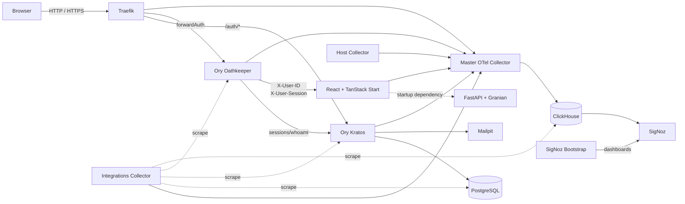

# Fullstack Template

Локальный fullstack/platform-шаблон на Docker Compose с готовой основой для
SSR-фронтенда, Python API, identity-сценариев и наблюдаемости. Репозиторий
собирает в одном стеке Traefik, Ory Kratos, Ory Oathkeeper, PostgreSQL,
ClickHouse, SigNoz, OpenTelemetry Collectors и Mailpit.

Проект находится в стадии активной разработки. Инфраструктурный контур уже
связан и проходит `docker compose config`, но прикладной backend пока содержит
только health endpoint, часть каталогов зарезервирована под будущие сервисы, а
текущие переменные окружения и правила доступа рассчитаны только на локальную
разработку. Перед production-развёртыванием обязательно выполните рекомендации
из раздела [«Подготовка к production»](#подготовка-к-production).

## Что реализовано

- SSR-фронтенд на React, TanStack Start/Router и Nitro.
- UI для login, registration, recovery, verification и settings flow Ory
  Kratos.
- Forward authentication через Traefik и Ory Oathkeeper.
- Python ASGI-интерфейс на FastAPI и Granian.
- PostgreSQL для identity-данных Kratos.
- Полный локальный контур SigNoz на ClickHouse.
- OTLP-приём логов, метрик и трейсов через master collector.
- Метрики хоста, Docker-контейнеров, PostgreSQL, ClickHouse, Kratos и
  Oathkeeper.
- Автоматическая загрузка семи SigNoz-дашбордов.
- Mailpit для просмотра локальных писем.
- Healthcheck'и и упорядоченный запуск зависимых контейнеров.

## Технологический стек

| Контур | Компоненты и версии, заданные в репозитории |
| --- | --- |
| Frontend | Node.js 24.15.0, React 19.2, TanStack Start/Router, Nitro 3 beta, Vite 8, TypeScript 6 |
| Python API | Python 3.14.6, FastAPI 0.139.0, Granian 2.7.9, Pydantic 2.13.4 |
| Gateway и identity | Traefik 3.7.1, Kratos 26.2.0, Oathkeeper 26.2.0 |
| Хранилища | PostgreSQL 18.3, ClickHouse 26.3.10.60 |
| Observability | SigNoz 0.122.0, SigNoz OTel Collector 0.144.4, OTel Collector Contrib 0.155.0 |
| Локальная почта | Mailpit; тег образа пока не закреплён |

JavaScript-зависимости фиксируются `pnpm-lock.yaml`, Python-зависимости — двумя
`uv.lock`. Версии runtime-образов, кроме отмеченных ниже исключений, закреплены
в Dockerfile.

## Архитектура


```mermaid
flowchart LR
    browser[Browser] -->|HTTP / HTTPS| traefik[Traefik]

    traefik -->|/auth/*| kratos[Ory Kratos]
    traefik -->|forwardAuth| oathkeeper[Ory Oathkeeper]
    oathkeeper -->|sessions/whoami| kratos
    oathkeeper -->|X-User-ID<br/>X-User-Session| frontend[React + TanStack Start]

    kratos --> postgres[(PostgreSQL)]
    kratos --> mailpit[Mailpit]

    frontend -. startup dependency .-> api[FastAPI + Granian]

    traefik --> collector[Master OTel Collector]
    frontend --> collector
    kratos --> collector
    oathkeeper --> collector
    host[Host Collector] --> collector
    integrations[Integrations Collector] --> collector
    integrations -. scrape .-> postgres
    integrations -. scrape .-> kratos
    integrations -. scrape .-> oathkeeper
    integrations -. scrape .-> clickhouse[(ClickHouse)]

    collector --> clickhouse
    clickhouse --> signoz[SigNoz]
    bootstrap[SigNoz Bootstrap] -->|dashboards| signoz
```

Запрос к приложению проходит через Traefik. Маршрут `/auth/*` отправляется
напрямую в публичный API Kratos, остальные маршруты сначала проходят проверку
Oathkeeper и затем попадают во frontend. Oathkeeper добавляет к запросу
`X-User-ID` и `X-User-Session`; серверная часть frontend читает из последнего
заголовка данные сессии.

Python API пока не опубликован через Traefik и не вызывается frontend-кодом.
Между контейнерами существует только зависимость порядка запуска.

## Активные Compose-сервисы

| Сервис | Назначение | Доступ с хоста |
| --- | --- | --- |
| `traefik` | Входная точка, TLS, HTTP/3, маршрутизация и OTLP-телеметрия | `8000/tcp`, `4443/tcp`, `4443/udp` |
| `frontend` | SSR-приложение и UI identity-flow | Через Traefik |
| `python-interface` | FastAPI-приложение с `/checks/liveliness` | Только внутри Compose-сети |
| `kratos` | Identity, сессии, регистрация, recovery и verification | Через `/auth/*` |
| `oathkeeper` | Forward auth и передача identity-заголовков | Только внутри Compose-сети |
| `postgres` | Основная БД и отдельная БД Kratos | Только внутри Compose-сети |
| `clickhouse` | Хранилище телеметрии SigNoz | Только внутри Compose-сети |
| `master-collector` | OTLP ingest и экспорт данных в ClickHouse | Только внутри Compose-сети |
| `host-collector` | Метрики Linux-хоста и Docker-контейнеров | Только внутри Compose-сети |
| `integrations-collector` | Метрики PostgreSQL и Prometheus endpoints | Только внутри Compose-сети |
| `collector_migrator` | Одноразовые миграции схем SigNoz | Не публикуется |
| `signoz` | UI и API наблюдаемости | `8080/tcp` |
| `signoz-bootstrap` | Одноразовая установка дашбордов и navbar settings | Не публикуется |
| `mail_server` | Mailpit SMTP и web UI | `8025/tcp` для UI |

Данные сохраняются в named volumes `postgres-data`, `clickhouse-data` и
`signoz-data`.

## Требования

- Docker Engine или Docker Desktop с Linux-контейнерами.
- Docker Compose v2 с поддержкой верхнеуровневого `include`.
- Достаточно памяти и диска для одновременной работы ClickHouse, SigNoz и
  нескольких collectors.

Конфигурация host collector ориентирована на Linux: контейнер читает `/proc`,
`/sys`, корневую файловую систему и Docker socket. На Docker Desktop состав и
смысл host-метрик могут отличаться.

## Быстрый старт

### 1. Проверьте локальные настройки

Все dev-переменные находятся в `environments/*.env`. До первого запуска как
минимум просмотрите:

- `environments/traefik.env` — домен и HTTPS-порт;
- `environments/postgres.env` — PostgreSQL;
- `environments/kratos.env` — имя cookie и криптографические секреты;
- `environments/signoz.env` — локальная учётная запись SigNoz;
- `environments/smtp.env` — SMTP endpoint.

Значения в репозитории демонстрационные и не являются безопасными секретами.

### 2. Проверьте итоговый Compose

```bash
docker compose config --quiet
docker compose config --services
```

Первая команда проверяет объединённую конфигурацию, вторая должна вывести 14
сервисов.

### 3. Соберите и запустите стек

```bash
docker compose up -d --build
```

Первый запуск может занять заметное время: Docker скачивает и собирает образы,
затем выполняются миграции PostgreSQL/Kratos и ClickHouse/SigNoz. Состояние
контейнеров можно отслеживать командами:

```bash
docker compose ps
docker compose logs -f
```

Для просмотра отдельного сервиса:

```bash
docker compose logs -f traefik
docker compose logs -f kratos
docker compose logs -f master-collector
```

### 4. Откройте интерфейсы

| Интерфейс | URL | Примечание |
| --- | --- | --- |
| Приложение | `https://localhost:4443` | Основная точка входа |
| HTTP-вход | `http://localhost:8000` | Перенаправляет на HTTPS |
| SigNoz | `http://localhost:8080` | Учётные данные находятся в `environments/signoz.env` |
| Mailpit | `http://localhost:8025` | Просмотр локальных писем |

В текущей конфигурации для Traefik не задан доверенный сертификат или ACME
resolver, поэтому браузер может показать предупреждение о локальном TLS.

### 5. Остановка

Остановить контейнеры, сохранив данные:

```bash
docker compose down
```

Полностью удалить контейнеры и named volumes:

```bash
docker compose down --volumes
```

Последняя команда безвозвратно удалит локальные данные PostgreSQL, ClickHouse и
SigNoz.

## Identity-flow

Frontend реализует следующие маршруты:

| Маршрут | Назначение |
| --- | --- |
| `/` | Главная страница и данные текущей сессии |
| `/login` | Вход |
| `/registration` | Регистрация |
| `/recovery` | Восстановление доступа |
| `/verification` | Подтверждение email |
| `/settings` | Настройки identity |
| `/error` | Отображение ошибки Kratos flow |
| `/health` | Health endpoint frontend-контейнера |

Если страница flow открывается без параметра `flow`, frontend перенаправляет
браузер на `/auth/self-service/<flow>/browser`. Kratos создаёт flow и возвращает
пользователя в соответствующий UI-маршрут. Формы строятся динамически из
`ui.nodes`, полученных от Kratos.

Текущая identity schema содержит один обязательный trait — email. Он
используется как password identifier, а также для verification и recovery.

## Наблюдаемость

`master-collector` принимает OTLP по gRPC и HTTP, обрабатывает логи, метрики и
трейсы и сохраняет их в ClickHouse. Телеметрия включена во frontend, Traefik,
Kratos и Oathkeeper.

`host-collector` собирает системные и process-метрики раз в 60 секунд, а
Docker-метрики — раз в 15 секунд. `integrations-collector` с тем же интервалом
получает:

- ClickHouse metrics endpoint;
- Kratos Prometheus metrics;
- Oathkeeper Prometheus metrics;
- PostgreSQL metrics.

После старта `signoz-bootstrap` добавляет дашборды:

- APM Metrics;
- ClickHouse Overview;
- Container Metrics;
- DB Calls Monitoring;
- Host Metrics;
- HTTP API Monitoring;
- Postgres Overview.

## Структура репозитория

```text
.
├── applications/
│   ├── frontend/                 # React + TanStack Start + Nitro
│   ├── backend/
│   │   ├── python/
│   │   │   ├── interface/       # Реализованный FastAPI-сервис
│   │   │   ├── scheduler/       # Зарезервировано
│   │   │   └── worker/          # Зарезервировано
│   │   └── rust/                 # Зарезервировано
│   └── management/               # Зарезервировано
├── infrastructure/
│   ├── authentication/           # Kratos и Oathkeeper
│   ├── gateways/                 # Traefik; WireGuard зарезервирован
│   ├── observability/            # SigNoz и OTel Collectors
│   ├── stateful/                 # PostgreSQL, ClickHouse и placeholders
│   └── other/                    # Mailpit
├── environments/                 # Переменные окружения сервисов
├── docker-compose.yaml           # Корневая композиция и опубликованные порты
└── docker-compose.override.yaml  # Пустая локальная точка расширения
```

Пустые Compose-файлы для Python worker/scheduler, Rust, management, WireGuard,
Redis, Redpanda, Meilisearch и SeaweedFS пока не создают сервисы. Они обозначают
планируемую структуру, а не уже доступные компоненты.

## Где менять конфигурацию

| Область | Файлы |
| --- | --- |
| Состав стека, зависимости и внешние порты | `docker-compose.yaml`, `applications/**/compose.yaml`, `infrastructure/**/compose.yaml` |
| Переменные окружения | `environments/*.env`, `environments/compose.yaml` |
| Traefik entrypoints и telemetry | `infrastructure/gateways/traefik/template.yml` |
| Traefik routers и middlewares | `infrastructure/gateways/traefik/dynamic/*` |
| Identity schema и self-service flow | `infrastructure/authentication/kratos/*` |
| Правила доступа Oathkeeper | `infrastructure/authentication/oathkeeper/rules.yaml` |
| OTLP pipelines | `infrastructure/observability/otel-collectors/services.yaml` |
| Host и integration metrics | `infrastructure/observability/otel-collectors/*-collector/*.yaml` |
| SigNoz bootstrap | `infrastructure/observability/signoz/bootstrap/` |

## Известные ограничения текущей конфигурации

1. Правило Oathkeeper совпадает с любым HTTP(S)-URL, допускает `anonymous` и
   использует authorizer `allow`. Сейчас оно передаёт identity-контекст, но не
   ограничивает доступ к маршрутам.
2. `environments/*.env` отслеживаются Git и содержат демонстрационные пароли и
   секреты. Это удобно только для локального стенда.
3. Python API содержит только `/checks/liveliness`, не маршрутизируется через
   Traefik и пока не отправляет собственную OpenTelemetry-телеметрию.
4. В репозитории пока нет автоматических тестов и CI-проверок.
5. `host-collector` запускается от root и получает read-only доступ к Docker
   socket, `/proc`, `/sys` и `/`. Это чувствительная конфигурация даже при
   read-only mounts.
6. Для Traefik не настроен доверенный TLS-сертификат; SigNoz и Mailpit
   публикуются напрямую, в обход Traefik.
7. Образ Mailpit и builder-образ `uv` используют плавающий тег, поэтому сборка
   не полностью воспроизводима.
8. Entrypoint-скрипты запускаются с shell tracing (`set -x`). В частности,
   Kratos формирует DSN и секреты после включения tracing, поэтому значения
   окружения могут попасть в логи контейнера.
9. ClickHouse Dockerfile скачивает исполняемый `histogramQuantile` без проверки
   checksum или подписи.

## Подготовка к production

Этот репозиторий следует воспринимать как основу, а не как готовый production
deployment. Перед внешним развёртыванием необходимо:

- вынести секреты из Git в Docker secrets, secret manager или средства
  оркестратора и заменить все демонстрационные значения;
- разделить dev- и production-конфигурации;
- создать отдельные публичные и защищённые правила Oathkeeper без fallback на
  `anonymous` для приватных маршрутов;
- настроить доверенный TLS, безопасные cookie, корректный public domain и
  защищённый SMTP;
- закрыть прямую публикацию административных интерфейсов или поставить их за
  authentication/VPN;
- пересмотреть доступ host collector к хосту и Docker socket;
- закрепить все image tags, желательно также использовать digest;
- отключить shell tracing для команд, работающих с секретами, и проверять
  загружаемые build-артефакты;
- добавить resource limits, backup/restore, retention и процедуру миграций;
- добавить unit, integration и end-to-end smoke tests в CI;
- проверить сценарии регистрации, login/logout, recovery и verification на
  отдельном тестовом окружении.

## Диагностика

Показать контейнеры, включая завершившиеся bootstrap-сервисы:

```bash
docker compose ps --all
```

Проверить health endpoint frontend через локальный TLS:

```bash
curl --insecure https://localhost:4443/health
```

Проверить Python API из Compose-сети:

```bash
docker compose exec python-interface \
  curl --fail http://localhost:8000/checks/liveliness
```

Если стек не доходит до healthy-состояния, начинайте с логов PostgreSQL,
ClickHouse и миграторов, затем проверяйте master collector, Kratos, Oathkeeper,
frontend и Traefik в порядке зависимостей.
